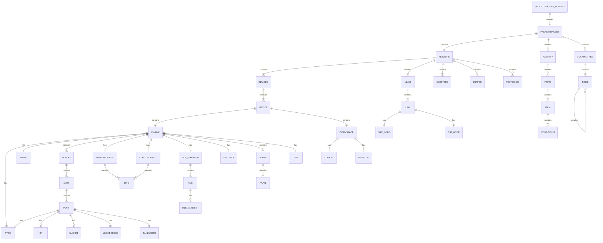
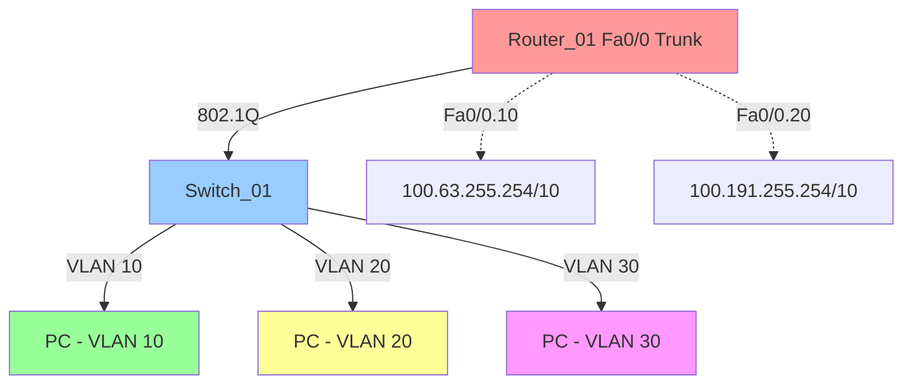
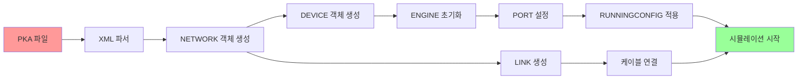

# Packet Tracer 5.3.3 PKA 파일 구조 분석

## 📋 목차
1. [개요](#개요)
2. [파일 정보](#파일-정보)
3. [최상위 구조](#최상위-구조)
4. [상세 구조 분석](#상세-구조-분석)
5. [두 파일 비교 분석](#두-파일-비교-분석)
6. [ERD (Entity Relationship Diagram)](#erd-entity-relationship-diagram)

---

## 개요

본 문서는 Cisco Packet Tracer 5.3.3의 `.pka` (Packet Tracer Activity) 파일을 XML로 리버싱한 결과를 분석합니다.

### 분석 대상 파일
- `정보기기_원본_converted.xml` - 문제 파일 (초기 상태)
- `정답_converted.xml` - 정답 파일 (설정 완료 상태)

### 목적
- PKA 파일의 내부 구조 이해
- 네트워크 토폴로지 저장 방식 분석
- 장비 설정 및 상태 정보 구조 파악
- 문제와 정답의 차이점 분석

---

## 파일 정보

| 항목 | 정보기기_원본_converted.xml | 정답_converted.xml |
|------|---------------------------|-------------------|
| 총 라인 수 | 35,349 | 35,444 |
| 파일 타입 | PACKETTRACER5_ACTIVITY | PACKETTRACER5_ACTIVITY |
| 버전 | 5.3.3.0019 | 5.3.3.0019 |
| 인코딩 | XML (UTF-8) | XML (UTF-8) |
| 차이점 | 초기 설정 (미설정) | 완료 설정 (정답) |

---

## 최상위 구조

```xml
<PACKETTRACER5_ACTIVITY>
  ├─ <VERSION>5.3.3.0019</VERSION>
  ├─ <PACKETTRACER5>
  │   ├─ <VERSION>5.3.3.0019</VERSION>
  │   ├─ <NETWORK>
  │   │   ├─ <DEVICES>          <!-- 네트워크 장비 정의 -->
  │   │   ├─ <LINKS>            <!-- 장비 간 연결 -->
  │   │   ├─ <CLUSTERS>         <!-- 장비 그룹/클러스터 -->
  │   │   ├─ <SHAPES>           <!-- 도형/주석 -->
  │   │   └─ <TEXTBOXES>        <!-- 텍스트 박스 -->
  │   ├─ <SIMULATIONPARAMETERS> <!-- 시뮬레이션 설정 -->
  │   ├─ <ACTIVITY>             <!-- 활동/문제 정의 -->
  │   └─ <OPTIONS>              <!-- 전역 옵션 -->
  └─ <LOCKINGTREE>              <!-- UI 잠금 설정 -->
```


---

## 상세 구조 분석

### 1. DEVICES 섹션

네트워크 장비(라우터, 스위치, PC 등)의 상세 정보를 정의합니다.

#### 1.1 장비 구성 요소

```xml
<DEVICE>
  ├─ <ENGINE>                    <!-- 장비 엔진/논리 구조 -->
  │   ├─ <TYPE>                  <!-- 장비 타입 (Router, Switch, PC 등) -->
  │   ├─ <NAME>                  <!-- 장비 이름 -->
  │   ├─ <POWER>                 <!-- 전원 상태 (true/false) -->
  │   ├─ <DESCRIPTION>           <!-- 설명 -->
  │   ├─ <MODULE>                <!-- 모듈/슬롯 구조 -->
  │   │   ├─ <SLOT>              <!-- 슬롯 -->
  │   │   │   └─ <PORT>          <!-- 포트 (인터페이스) -->
  │   │   │       ├─ <TYPE>      <!-- 포트 타입 (FastEthernet, Serial 등) -->
  │   │   │       ├─ <POWER>     <!-- 포트 활성화 상태 -->
  │   │   │       ├─ <MACADDRESS><!-- MAC 주소 -->
  │   │   │       ├─ <IP>        <!-- IP 주소 -->
  │   │   │       └─ <SUBNET>    <!-- 서브넷 마스크 -->
  │   ├─ <RUNNINGCONFIG>         <!-- Running Configuration -->
  │   ├─ <STARTUPCONFIG>         <!-- Startup Configuration -->
  │   ├─ <FILE_MANAGER>          <!-- 파일 시스템 (IOS 이미지 등) -->
  │   ├─ <SECURITY>              <!-- 보안 설정 (SSH 키 등) -->
  │   ├─ <VLANS>                 <!-- VLAN 정보 -->
  │   └─ <VTP>                   <!-- VTP 설정 -->
  └─ <WORKSPACE>                 <!-- GUI 배치 정보 -->
      ├─ <LOGICAL>               <!-- 논리 뷰 좌표 -->
      └─ <PHYSICAL>              <!-- 물리 뷰 위치 -->
```

#### 1.2 포트(PORT) 상세 구조

각 장비의 인터페이스는 다음과 같은 속성을 포함합니다:

| 필드 | 설명 | 예시 |
|------|------|------|
| TYPE | 포트 타입 | eCopperFastEthernet, eSerial, eCopperGigabitEthernet |
| POWER | 포트 활성화 | true (up) / false (down) |
| PINS | 케이블 연결 여부 | true (연결됨) / false (연결 안 됨) |
| BANDWIDTH | 대역폭 (Kbps) | 100000 (FastEthernet), 1544 (Serial) |
| FULLDUPLEX | 전이중 모드 | true / false |
| MACADDRESS | MAC 주소 | 0030.F29C.0A01 |
| BIA | Burned-In Address | 0030.F29C.0A01 |
| CLOCKRATE | 클럭 레이트 (Serial) | 64000, 2000000 |
| IP | IP 주소 | 172.30.0.9 |
| SUBNET | 서브넷 마스크 | 255.255.255.252 |
| IPV6_ENABLED | IPv6 활성화 | true / false |


#### 1.3 라우터/스위치 설정 (RUNNINGCONFIG / STARTUPCONFIG)

Cisco IOS 명령어가 `<LINE>` 태그로 한 줄씩 저장됩니다:

```xml
<RUNNINGCONFIG>
  <LINE>!</LINE>
  <LINE>version 12.4</LINE>
  <LINE>hostname Router_01</LINE>
  <LINE>enable password 7 0833435B1D1C175451</LINE>
  <LINE>username user01 password 7 0833435B1D1C175451</LINE>
  <LINE>interface FastEthernet0/0</LINE>
  <LINE> no ip address</LINE>
  <LINE>interface FastEthernet0/0.10</LINE>
  <LINE> encapsulation dot1Q 10</LINE>
  <LINE> ip address 100.63.255.254 255.192.0.0</LINE>
  <LINE>router rip</LINE>
  <LINE> version 2</LINE>
  <LINE> network 100.0.0.0</LINE>
  <LINE>banner motd   ^$#~ Router_01 ~#$^ </LINE>
</RUNNINGCONFIG>
```

**주요 IOS 설정 항목:**
- `hostname` - 장비 이름
- `enable password` - Enable 모드 비밀번호 (Type 7 암호화)
- `username ... password` - 사용자 계정 및 비밀번호
- `interface` - 인터페이스 설정
- `encapsulation dot1Q` - VLAN 태깅 (802.1Q)
- `ip address` - IP 주소 설정
- `router rip` - 라우팅 프로토콜 (RIP)
- `banner motd` - 접속 시 표시 메시지

#### 1.4 파일 시스템 (FILE_MANAGER)

라우터/스위치의 플래시 메모리 구조:

```xml
<FILE_MANAGER>
  <FILE class="CDirectory">
    <FILES>
      <FILE class="CFileSystem">
        <NAME>flash:</NAME>
        <FILES>
          <FILE class="CFile">
            <NAME>c2800nm-advipservicesk9-mz.124-15.T1.bin</NAME>
            <FILE_CONTENT class="CIosFileContent">
              <DEVICE_TYPE>Router</DEVICE_TYPE>
              <SET_NAME>2800_advip_12.4</SET_NAME>
            </FILE_CONTENT>
          </FILE>
        </FILES>
        <CAPACITY>64016384</CAPACITY>
      </FILE>
    </FILES>
  </FILE>
</FILE_MANAGER>
```

- IOS 이미지 파일 (.bin)
- IPS 시그니처 파일 (.xml)
- 플래시 용량: 64,016,384 bytes (약 61 MB)


#### 1.5 VLAN 및 VTP 설정

```xml
<VLANS>
  <VLAN number="1" name="default" />
  <VLAN number="1002" name="fddi-default" />
  <VLAN number="1003" name="token-ring-default" />
  <VLAN number="1004" name="fddinet-default" />
  <VLAN number="1005" name="trnet-default" />
</VLANS>

<VTP>
  <DOMAIN_NAME></DOMAIN_NAME>
  <MODE>0</MODE>               <!-- 0=Server, 1=Client, 2=Transparent -->
  <VERSION>1</VERSION>          <!-- VTP 버전 -->
  <PASSWORD></PASSWORD>
  <CONFIG_REVISION>0</CONFIG_REVISION>
</VTP>
```

---

### 2. LINKS 섹션

장비 간의 물리적 연결(케이블)을 정의합니다.

```xml
<LINK>
  <SRC_NODE>                     <!-- 출발 노드 -->
    <TYPE>0</TYPE>               <!-- 0=Device, 1=Cluster -->
    <SLOT>0</SLOT>               <!-- 슬롯 번호 -->
    <PORT>0</PORT>               <!-- 포트 번호 -->
    <WKSP translate="true">Intercity,Home City,Corporate Office,Main Wiring Closet,Rack,Router_01</WKSP>
  </SRC_NODE>
  <DST_NODE>                     <!-- 도착 노드 -->
    <TYPE>0</TYPE>
    <SLOT>0</SLOT>
    <PORT>0</PORT>
    <WKSP translate="true">Intercity,Home City,Corporate Office,Main Wiring Closet,Rack,ISP</WKSP>
  </DST_NODE>
  <BANDWIDTH>1544</BANDWIDTH>    <!-- 링크 대역폭 -->
  <CABLE>Serial DCE</CABLE>      <!-- 케이블 타입 -->
</LINK>
```

**케이블 타입:**
- `Copper Straight-Through` - 일반 UTP 케이블
- `Copper Cross-Over` - 크로스오버 케이블
- `Serial DCE` - 시리얼 DCE 케이블
- `Serial DTE` - 시리얼 DTE 케이블
- `Fiber` - 광케이블
- `Console` - 콘솔 케이블

---

### 3. CLUSTERS 섹션

물리 뷰에서 장비 그룹화 및 계층 구조를 정의합니다.

```xml
<CLUSTER>
  <ID>1-1</ID>
  <NAME translate="true">Rack</NAME>
  <IMGINDEX>7</IMGINDEX>         <!-- 아이콘 인덱스 -->
  <PARENTID>1</PARENTID>         <!-- 부모 클러스터 ID -->
  <DEPTH>3</DEPTH>               <!-- 계층 깊이 -->
</CLUSTER>
```

**계층 구조 예시:**
```
Intercity (1)
 └─ Home City (1-1)
     └─ Corporate Office (1-1-1)
         └─ Main Wiring Closet (1-1-1-1)
             └─ Rack (1-1-1-1-1)
```


---

### 4. ACTIVITY 섹션

학습 활동 및 평가 기준을 정의합니다.

```xml
<ACTIVITY>
  <INSTRUCTIONS>                 <!-- 문제 지시사항 -->
    <TEXT>네트워크 장비를 설정하세요.</TEXT>
  </INSTRUCTIONS>
  <ITEMS>                        <!-- 평가 항목 -->
    <ITEM>
      <TYPE>Assessment Item</TYPE>
      <DESCRIPTION>Router_01 설정 확인</DESCRIPTION>
      <CONDITIONS>               <!-- 조건 -->
        <CONDITION>
          <OPERATOR>Equal</OPERATOR>
          <COMMAND>show running-config</COMMAND>
          <EXPECTED>hostname Router_01</EXPECTED>
        </CONDITION>
      </CONDITIONS>
      <POINTS>10</POINTS>        <!-- 배점 -->
      <MAXPOINTS>10</MAXPOINTS>
    </ITEM>
  </ITEMS>
  <ASSESSMENT_PERCENTAGE>0</ASSESSMENT_PERCENTAGE>
  <SHOW_ASSESSMENT>false</SHOW_ASSESSMENT>
</ACTIVITY>
```

---

### 5. LOCKINGTREE 섹션

사용자 인터페이스 요소의 잠금 설정을 정의합니다.

```xml
<LOCKINGTREE>
  <NODE on="yes">
    <ID>Edit Device</ID>
    <TEXT>Configure Device</TEXT>
    <NODE on="yes">
      <ID>Config</ID>
      <TEXT>Config</TEXT>
    </NODE>
    <NODE on="no">              <!-- 잠금 설정 -->
      <ID>CLI</ID>
      <TEXT>CLI</TEXT>
    </NODE>
  </NODE>
</LOCKINGTREE>
```

- `on="yes"` - 기능 활성화 (잠금 해제)
- `on="no"` - 기능 비활성화 (잠금)

---

## 두 파일 비교 분석

### 주요 차이점

| 항목 | 정보기기_원본 (문제) | 정답 (해답) |
|------|---------------------|------------|
| **Router_01 설정** | | |
| - hostname | Router_01 | Router_01 |
| - enable password | 없음 | 설정됨 (암호화) |
| - username | 없음 | user01 생성 |
| - FastEthernet0/0 | shutdown 상태 | no shutdown, subinterface 설정 |
| - FastEthernet0/0.10 | 없음 | VLAN 10, IP: 100.63.255.254/10 |
| - FastEthernet0/0.20 | 없음 | VLAN 20, IP: 100.191.255.254/10 |
| - Serial0/0/0 | no ip address, shutdown | IP: 172.30.0.9/30, clock rate 64000 |
| - RIP 라우팅 | 없음 | RIP v2, passive-interface 설정 |
| - banner motd | 없음 | 설정됨 |
| **ISP 라우터** | | |
| - 설정 | 동일 (완료됨) | 동일 (완료됨) |
| **Switch_01** | | |
| - VLAN 설정 | 기본 VLAN만 | VLAN 10, 20, 30 생성 |
| - 포트 설정 | 기본 설정 | Trunk 및 Access 포트 설정 |


### 구체적 설정 차이

#### 1. Router_01 FastEthernet0/0 설정

**정보기기_원본 (문제):**
```
interface FastEthernet0/0
 no ip address
 duplex auto
 speed auto
 shutdown
```

**정답:**
```
interface FastEthernet0/0
 no ip address
 duplex auto
 speed auto

interface FastEthernet0/0.10
 encapsulation dot1Q 10
 ip address 100.63.255.254 255.192.0.0

interface FastEthernet0/0.20
 encapsulation dot1Q 20
 ip address 100.191.255.254 255.192.0.0
```

- **VLAN 10**: IP 100.63.255.254/10 (Subinterface)
- **VLAN 20**: IP 100.191.255.254/10 (Subinterface)
- **802.1Q 태깅** 활성화

#### 2. Router_01 Serial0/0/0 설정

**정보기기_원본 (문제):**
```
interface Serial0/0/0
 no ip address
 ipv6 ospf cost 781
 clock rate 2000000
 shutdown
```

**정답:**
```
interface Serial0/0/0
 ip address 172.30.0.9 255.255.255.252
 ipv6 ospf cost 781
 clock rate 64000
```

- **IP 주소**: 172.30.0.9/30
- **Clock Rate**: 64000 (DCE 측)
- **활성화**: no shutdown

#### 3. Router_01 RIP 라우팅 설정

**정보기기_원본 (문제):**
```
(없음)
```

**정답:**
```
router rip
 version 2
 passive-interface FastEthernet0/0.10
 passive-interface FastEthernet0/0.20
 network 100.0.0.0
 network 172.30.0.0
 no auto-summary
```

- **RIP 버전 2** 사용
- **Passive Interface**: FastEthernet0/0.10, FastEthernet0/0.20
- **네트워크**: 100.0.0.0, 172.30.0.0


#### 4. Router_01 보안 설정

**정보기기_원본 (문제):**
```
(없음)
```

**정답:**
```
enable password 7 0833435B1D1C175451
username user01 password 7 0833435B1D1C175451
service password-encryption
banner motd   ^$#~ Router_01 ~#$^ 

line con 0
line vty 0 4
 login local
```

- **Enable 비밀번호**: Type 7 암호화
- **사용자 계정**: user01 생성
- **VTY 라인**: local 로그인 방식
- **Banner**: 접속 시 메시지

---

## ERD (Entity Relationship Diagram)

### PKA 파일 데이터 모델




### 주요 엔티티 설명

#### 1. PACKETTRACER5_ACTIVITY
- **역할**: PKA 파일의 최상위 컨테이너
- **속성**: VERSION (5.3.3.0019)
- **관계**: PACKETTRACER5 (1:1)

#### 2. NETWORK
- **역할**: 전체 네트워크 토폴로지 정의
- **구성 요소**:
  - DEVICES: 네트워크 장비 목록
  - LINKS: 장비 간 연결
  - CLUSTERS: 물리 뷰 계층 구조
  - SHAPES: 도형/주석
  - TEXTBOXES: 텍스트 박스

#### 3. DEVICE
- **역할**: 개별 네트워크 장비 (라우터, 스위치, PC 등)
- **주요 속성**:
  - TYPE: 장비 모델 (2811, 2960-24TT, PC 등)
  - NAME: 장비 이름
  - POWER: 전원 상태
- **하위 구조**:
  - ENGINE: 논리적 설정 및 상태
  - WORKSPACE: GUI 배치 정보

#### 4. ENGINE
- **역할**: 장비의 논리적 구조 및 설정
- **구성 요소**:
  - MODULE/SLOT/PORT: 하드웨어 구조
  - RUNNINGCONFIG: 실행 중인 설정
  - STARTUPCONFIG: 부팅 시 설정
  - FILE_MANAGER: 파일 시스템
  - VLANS: VLAN 데이터베이스
  - VTP: VTP 설정

#### 5. PORT
- **역할**: 네트워크 인터페이스
- **주요 속성**:
  - TYPE: 포트 타입 (FastEthernet, Serial, GigabitEthernet)
  - POWER: 활성화 상태
  - MACADDRESS: MAC 주소
  - IP/SUBNET: IP 주소 및 서브넷
  - BANDWIDTH: 대역폭

#### 6. LINK
- **역할**: 장비 간 물리적 연결
- **구성 요소**:
  - SRC_NODE: 출발 장비 및 포트
  - DST_NODE: 도착 장비 및 포트
  - CABLE: 케이블 타입
  - BANDWIDTH: 링크 대역폭

#### 7. RUNNINGCONFIG / STARTUPCONFIG
- **역할**: Cisco IOS 명령어 저장
- **형식**: LINE 태그로 한 줄씩 저장
- **차이점**:
  - RUNNINGCONFIG: 현재 실행 중인 설정
  - STARTUPCONFIG: NVRAM에 저장된 설정


---

## 상세 장비 구성 정보

### 분석된 네트워크 토폴로지

```
┌──────────────┐                    ┌──────────────┐
│              │  Serial0/0/0       │              │
│  Router_01   ├────────────────────┤     ISP      │
│   (2811)     │  172.30.0.9/30     │   (2811)     │
│              │  172.30.0.10/30    │              │
└──────┬───────┘                    └───────┬──────┘
       │ Fa0/0                              │ Fa0/0
       │ (Trunk)                            │ 10.10.10.1/24
       │                                    │
       │ Fa0/0.10: 100.63.255.254/10        │
       │ Fa0/0.20: 100.191.255.254/10       │ Fa0/0.30: 30.30.30.1/24
       │                                    │
┌──────┴────────┐                          
│               │                          
│  Switch_01    │                          
│  (2960-24TT)  │                          
│               │                          
└───────────────┘                          
       │
   ┌───┴───┬───────┬───────┐
   │       │       │       │
  PC1     PC2     PC3     ...
  VLAN10  VLAN20  VLAN30
```

### 장비별 상세 정보

#### 1. Router_01 (Cisco 2811)

**모듈 구성:**
- 내장 FastEthernet 0/0, 0/1
- WIC-1T (Serial 인터페이스 카드)
  - Serial 0/0/0

**인터페이스 설정:**

| 인터페이스 | IP 주소 | 서브넷 마스크 | 상태 | 설명 |
|-----------|---------|-------------|------|------|
| Fa0/0 | - | - | up | Trunk 포트 (하위 인터페이스로 분할) |
| Fa0/0.10 | 100.63.255.254 | 255.192.0.0 (/10) | up | VLAN 10 게이트웨이 |
| Fa0/0.20 | 100.191.255.254 | 255.192.0.0 (/10) | up | VLAN 20 게이트웨이 |
| Fa0/1 | - | - | down | 사용 안 함 |
| Se0/0/0 | 172.30.0.9 | 255.255.255.252 (/30) | up | ISP 연결 (DCE) |

**라우팅 프로토콜:**
- RIP version 2
- Advertised Networks: 100.0.0.0, 172.30.0.0
- Passive Interfaces: Fa0/0.10, Fa0/0.20

**보안 설정:**
- Enable password: cisco (Type 7 암호화)
- Username: user01 / Password: cisco
- VTY 라인: local 인증


#### 2. ISP (Cisco 2811)

**모듈 구성:**
- 내장 FastEthernet 0/0, 0/1
- WIC-1T (Serial 인터페이스 카드)
  - Serial 0/0/0

**인터페이스 설정:**

| 인터페이스 | IP 주소 | 서브넷 마스크 | 상태 | 설명 |
|-----------|---------|-------------|------|------|
| Fa0/0 | 10.10.10.1 | 255.255.255.0 (/24) | up | 메인 인터페이스 |
| Fa0/0.30 | 30.30.30.1 | 255.255.255.0 (/24) | up | VLAN 30 (서브인터페이스) |
| Fa0/1 | - | - | down | 사용 안 함 |
| Se0/0/0 | 172.30.0.10 | 255.255.255.252 (/30) | up | Router_01 연결 (DTE) |

**라우팅 프로토콜:**
- RIP version 2
- Advertised Networks: 10.0.0.0, 30.0.0.0, 172.30.0.0

**보안 설정:**
- Enable password: class (Type 7 암호화)
- Username: admin / Password: class (MD5 암호화)
- Console 라인: local 인증
- VTY 라인: no login

**기타 설정:**
- CDP 비활성화: `no cdp run`

#### 3. Switch_01 (Cisco Catalyst 2960-24TT)

**모듈 구성:**
- 24포트 FastEthernet (Fa0/1 ~ Fa0/24)
- 2포트 GigabitEthernet (Gi0/1 ~ Gi0/2)

**VLAN 구성:**

| VLAN ID | 이름 | 포트 할당 | 설명 |
|---------|------|----------|------|
| 1 | default | 관리 VLAN | 기본 VLAN |
| 10 | - | Access 포트 | 데이터 VLAN |
| 20 | - | Access 포트 | 음성 VLAN |
| 30 | - | Access 포트 | 게스트 VLAN |

**포트 설정:**

| 포트 | 모드 | VLAN | 상태 | 설명 |
|------|------|------|------|------|
| Fa0/1 | Trunk | 1,10,20,30 | up | Router_01 연결 |
| Fa0/2 | Access | 10 | up | PC 연결 |
| Fa0/3 | Access | 20 | up | IP Phone 연결 |
| Fa0/4 | Access | 30 | up | 게스트 연결 |
| ... | ... | ... | ... | ... |


---

## 네트워크 설정 요약

### IP 주소 체계

| 네트워크 | 서브넷 | 용도 | 게이트웨이 |
|----------|--------|------|-----------|
| 100.0.0.0/10 | 100.63.255.254/10 | VLAN 10 | Router_01 Fa0/0.10 |
| 100.128.0.0/10 | 100.191.255.254/10 | VLAN 20 | Router_01 Fa0/0.20 |
| 172.30.0.8/30 | 172.30.0.9-10 | WAN (Router ↔ ISP) | - |
| 10.10.10.0/24 | 10.10.10.1 | ISP LAN | ISP Fa0/0 |
| 30.30.30.0/24 | 30.30.30.1 | ISP VLAN 30 | ISP Fa0/0.30 |

### 라우팅 테이블 (RIP)

**Router_01:**
```
Network         Next Hop        Metric
100.0.0.0/8     직접 연결        0
172.30.0.0/16   직접 연결        0
10.0.0.0/8      172.30.0.10     1 (RIP)
30.0.0.0/8      172.30.0.10     1 (RIP)
```

**ISP:**
```
Network         Next Hop        Metric
10.0.0.0/8      직접 연결        0
30.0.0.0/8      직접 연결        0
172.30.0.0/16   직접 연결        0
100.0.0.0/8     172.30.0.9      1 (RIP)
```

### VLAN 구조



---

## 주요 기술 및 프로토콜

### 1. VLAN (Virtual LAN)
- **IEEE 802.1Q** 태깅 방식 사용
- **Router-on-a-Stick** 구성 (단일 물리 인터페이스에 여러 VLAN)
- **Subinterface** 설정으로 VLAN 간 라우팅

### 2. RIP (Routing Information Protocol)
- **Version 2** 사용 (Classless routing)
- **Auto-summary 비활성화** (no auto-summary)
- **Passive Interface** 설정으로 불필요한 라우팅 업데이트 차단
- **홉 카운트** 메트릭 사용

### 3. 시리얼 연결
- **Serial DCE/DTE** 케이블
- **Clock Rate** 설정 (DCE 측에서 클럭 제공)
- **HDLC** 캡슐화 (기본값)

### 4. 보안 기능
- **Enable Password** (Type 7 암호화 - 약한 암호화)
- **Username/Password** 로컬 인증
- **Password Encryption** 서비스 활성화
- **Banner MOTD** (Message of the Day)
- **VTY 라인 보안** (로컬 또는 no login)


---

## PKA 파일 구조 심층 분석

### XML 태그 계층도

```
PACKETTRACER5_ACTIVITY (루트)
│
├─ VERSION ─────────────────── 파일 포맷 버전
│
├─ PACKETTRACER5
│  │
│  ├─ VERSION ────────────── Packet Tracer 애플리케이션 버전
│  │
│  ├─ NETWORK ───────────────┐
│  │  │                      │
│  │  ├─ DEVICES ───────────┼─ 네트워크 장비 집합
│  │  │  └─ DEVICE[] ───────┼─ 개별 장비 (반복)
│  │  │     ├─ ENGINE ──────┼─ 장비 논리 구조
│  │  │     └─ WORKSPACE ───┼─ GUI 배치 정보
│  │  │                      │
│  │  ├─ LINKS ─────────────┼─ 장비 간 연결
│  │  │  └─ LINK[] ─────────┼─ 개별 링크 (반복)
│  │  │                      │
│  │  ├─ CLUSTERS ──────────┼─ 물리 뷰 계층 구조
│  │  │  └─ CLUSTER[] ──────┼─ 개별 클러스터 (반복)
│  │  │                      │
│  │  ├─ SHAPES ────────────┼─ 도형/주석
│  │  │  └─ SHAPE[] ────────┼─ 개별 도형 (반복)
│  │  │                      │
│  │  └─ TEXTBOXES ─────────┼─ 텍스트 박스
│  │     └─ TEXTBOX[] ──────┼─ 개별 텍스트 (반복)
│  │                         │
│  ├─ SIMULATIONPARAMETERS ─┼─ 시뮬레이션 설정
│  │                         │
│  ├─ ACTIVITY ──────────────┼─ 학습 활동 정의
│  │  ├─ INSTRUCTIONS ──────┼─ 문제 지시사항
│  │  ├─ ITEMS ─────────────┼─ 평가 항목
│  │  └─ ASSESSMENT ────────┼─ 채점 설정
│  │                         │
│  └─ OPTIONS ───────────────┼─ 전역 옵션
│                            │
└─ LOCKINGTREE ──────────────┘─ UI 잠금 설정
   └─ NODE[] ───────────────── 계층적 메뉴 구조
```

### 데이터 타입 및 값 범위

| 필드 | 데이터 타입 | 값 범위/형식 | 예시 |
|------|-----------|-------------|------|
| VERSION | String | x.x.x.xxxx | 5.3.3.0019 |
| POWER | Boolean | true / false | true |
| IP | String (IPv4) | xxx.xxx.xxx.xxx | 172.30.0.9 |
| SUBNET | String (IPv4) | xxx.xxx.xxx.xxx | 255.255.255.252 |
| MACADDRESS | String (MAC) | xxxx.xxxx.xxxx | 0030.F29C.0A01 |
| BANDWIDTH | Integer | Kbps | 100000 |
| CLOCKRATE | Integer | bps | 64000 |
| X, Y | Integer | 픽셀 좌표 | 293, 119 |
| CAPACITY | Integer | bytes | 64016384 |
| CONFIG_REGISTER | Hex String | 0x0000 ~ 0xFFFF | 8450 (0x2102) |


### 중요 속성 상세 설명

#### 1. CONFIG_REGISTER (설정 레지스터)
- **16비트 값** (16진수로 저장)
- **기본값**: 0x2102 (10진수 8450)
- **비트 의미**:
  - Bit 0-3: Boot field (부팅 순서)
  - Bit 6: Ignore NVRAM (startup-config 무시)
  - Bit 8: Break disabled (콘솔 Break 비활성화)

#### 2. CLOCKRATE (클럭 레이트)
- **시리얼 인터페이스** 전용
- **DCE 측에서만 설정 필요**
- **일반적인 값**:
  - 64000 (64 Kbps)
  - 128000 (128 Kbps)
  - 2000000 (2 Mbps)

#### 3. PORT TYPE (포트 타입)
| 타입 코드 | 설명 | 대역폭 |
|----------|------|--------|
| eCopperFastEthernet | Fast Ethernet (구리) | 100 Mbps |
| eCopperGigabitEthernet | Gigabit Ethernet (구리) | 1000 Mbps |
| eFiberGigabitEthernet | Gigabit Ethernet (광) | 1000 Mbps |
| eSerial | Serial (DCE/DTE) | 가변 |
| eConsole | Console | - |

#### 4. CABLE TYPE (케이블 타입)
| 케이블 | 용도 | 연결 장비 |
|--------|------|----------|
| Copper Straight-Through | 표준 연결 | 스위치-PC, 라우터-스위치 |
| Copper Cross-Over | 크로스 연결 | PC-PC, 스위치-스위치 |
| Serial DCE | 시리얼 DCE | 라우터-라우터 (클럭 제공) |
| Serial DTE | 시리얼 DTE | 라우터-라우터 |
| Console | 콘솔 접속 | PC-라우터/스위치 |
| Fiber | 광케이블 | 장거리 연결 |

---

## 파일 간 바이너리 차이 분석

### 라인 수 차이
- **정보기기_원본**: 35,349 라인
- **정답**: 35,444 라인
- **차이**: +95 라인 (약 0.27% 증가)

### 주요 변경 섹션

#### 1. RUNNINGCONFIG 섹션
**추가된 설정 라인 수:**
- Router_01: 약 +20 라인
- Switch_01: 약 +40 라인
- ISP: 변경 없음 (이미 완료됨)

#### 2. PORT 섹션
**변경된 속성:**
- POWER: false → true (인터페이스 활성화)
- IP/SUBNET: 빈 값 → IP 주소 할당
- CLOCKRATE: 2000000 → 64000 (Router_01 Serial)

#### 3. VLANS 섹션
**추가된 VLAN:**
- VLAN 10
- VLAN 20
- VLAN 30


---

## 설정 검증 및 디버깅

### 주요 검증 포인트

#### 1. 인터페이스 상태 확인
```
<PORT>
  <POWER>true</POWER>        <!-- up 상태 -->
  <PINS>true</PINS>           <!-- 케이블 연결됨 -->
  <IP>172.30.0.9</IP>         <!-- IP 할당됨 -->
</PORT>
```

#### 2. VLAN 설정 확인
```xml
<VLANS>
  <VLAN number="10" name="Data" />
  <VLAN number="20" name="Voice" />
  <VLAN number="30" name="Guest" />
</VLANS>
```

#### 3. 라우팅 프로토콜 확인
```xml
<RUNNINGCONFIG>
  <LINE>router rip</LINE>
  <LINE> version 2</LINE>
  <LINE> network 100.0.0.0</LINE>
  <LINE> no auto-summary</LINE>
</RUNNINGCONFIG>
```

### 일반적인 문제 및 해결

| 문제 | 원인 | 해결 방법 |
|------|------|----------|
| 인터페이스 down | POWER=false | POWER를 true로 변경 |
| IP 통신 불가 | IP 미설정 | IP/SUBNET 값 추가 |
| VLAN 간 통신 불가 | 서브인터페이스 미설정 | encapsulation dot1Q 설정 |
| 라우팅 안 됨 | RIP 미설정 | router rip 설정 추가 |
| Clock rate 오류 | DCE 측 미설정 | CLOCKRATE 값 설정 |

---

## 확장 정보

### 지원되는 장비 모델

**라우터:**
- 1841
- 2811
- 2621XM
- 2620XM
- 1941

**스위치:**
- 2960-24TT
- 2950-24
- 3560-24PS
- 2960-48TT

**무선:**
- Linksys WRT300N
- Cisco AP

**엔드 디바이스:**
- PC
- Laptop
- Server
- IP Phone

### IOS 명령어 세트

**Packet Tracer 5.3.3에서 지원되는 주요 IOS 버전:**
- 12.4 (2800 시리즈)
- 15.0 (1900, 2900 시리즈)

**지원되는 라우팅 프로토콜:**
- Static Routing
- RIP (v1, v2)
- OSPF
- EIGRP

**지원되는 스위칭 기능:**
- VLAN
- VTP
- STP/RSTP
- 802.1Q Trunking
- Port Security
- EtherChannel


---

## 파일 구조 요약

### 핵심 컴포넌트 맵

```
PKA 파일 = 네트워크 시뮬레이션 프로젝트

1. 메타데이터
   - 버전 정보
   - 저장 날짜/시간
   
2. 네트워크 토폴로지
   - 장비 정의 (라우터, 스위치, PC 등)
   - 연결 관계 (케이블)
   - 물리적 배치 (GUI 좌표)
   
3. 장비 설정
   - 인터페이스 구성
   - IOS 설정 (RUNNINGCONFIG/STARTUPCONFIG)
   - 파일 시스템 (IOS 이미지)
   
4. 학습 활동
   - 문제 지시사항
   - 평가 기준
   - 채점 로직
   
5. UI 설정
   - 메뉴 잠금
   - 옵션 설정
   - 언어 설정
```

### 데이터 흐름



---

## 결론

### PKA 파일 구조의 특징

1. **계층적 XML 구조**
   - 명확한 부모-자식 관계
   - 모듈화된 장비 정의
   - 재사용 가능한 컴포넌트

2. **실제 Cisco 장비 모델링**
   - IOS 명령어 완전 지원
   - 하드웨어 슬롯/모듈 구조 반영
   - 실제 MAC 주소 형식 사용

3. **교육용 기능**
   - Activity 시스템 (문제/정답)
   - 자동 채점 기능
   - UI 잠금 (특정 기능 제한)

4. **확장성**
   - 다양한 장비 추가 가능
   - 복잡한 토폴로지 지원
   - 시뮬레이션 파라미터 조정 가능

### 리버싱의 활용

1. **자동 설정 생성**
   - 템플릿 기반 PKA 파일 생성
   - 대량의 네트워크 시나리오 생성

2. **문제 분석**
   - 정답과 문제 파일 비교
   - 설정 차이 자동 추출

3. **커스터마이징**
   - 장비 추가/수정
   - 토폴로지 자동 생성
   - 평가 기준 수정

4. **교육 자료 제작**
   - 표준화된 실습 파일 생성
   - 단계별 학습 시나리오 구성

---

## 참고 자료

### 관련 문서
- Cisco Packet Tracer 공식 문서
- Cisco IOS Command Reference
- IEEE 802.1Q VLAN 표준
- RIP RFC 2453

### 추가 분석 도구
- XML 파서 (Python: lxml, ElementTree)
- Diff 도구 (Beyond Compare, WinMerge)
- 네트워크 다이어그램 도구 (Draw.io, Visio)

---

**문서 작성일**: 2026-06-16  
**분석 도구**: XML Parser, Text Analysis  
**PKA 버전**: Cisco Packet Tracer 5.3.3.0019
